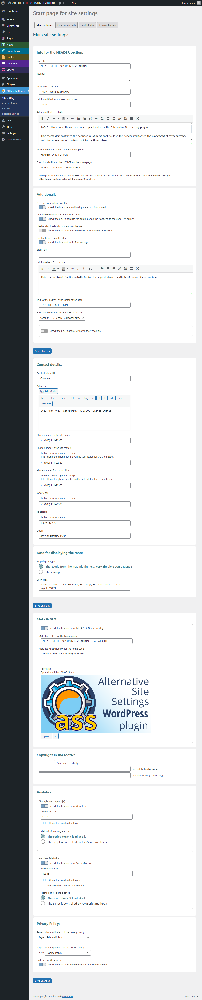
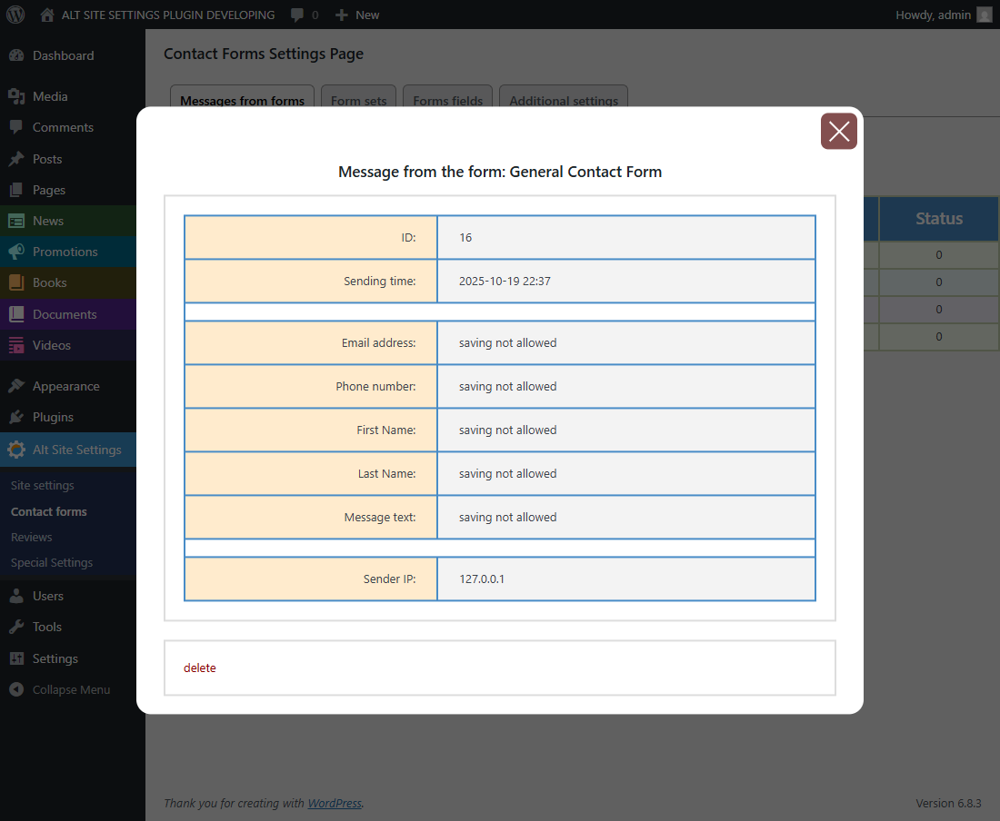
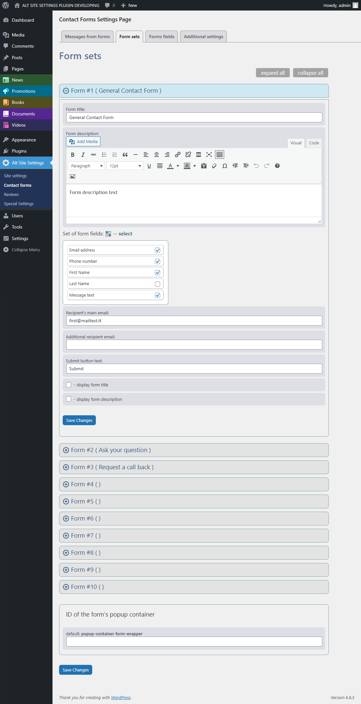

# Alternative Site Settings Plugin for WordPress

## Description

The Alternative Site Settings plugin was originally intended as a starting set of functions for the further development of an individual project. As a result, it was optimized and can be used for small standard projects,
such as a landing page or a business card website.

The plugin contains the following functionality:

* Editing basic settings, such as the name and description of the site, the content of meta tags for the main page, og:image for the main page, copyright information, additional text fields for the header and footer.
* Fields for the contact information section, which is usually located at the bottom of the landing page or in the footer of the site. The contacts section also either includes a map via a shortcode of a third-party plugin, or a static image with an office location diagram is inserted.
* Five ready-made options for custom records - News, Promotions, Documents, Books, Videos. Each recording type is disabled by default.
* Contact forms with a minimum set of seven fields. They satisfy the basic needs when using pop-up feedback forms.
* The "Reviews" section allows you to organize moderated reviews from site visitors.
* It is possible to collapse the top admin panel on the frontend to the upper left corner.
* Version 1.1.0 adds the ability to completely disable comments on the site.

Attention! The plugin is focused on working with classic themes.

## Changelog

### 1.1.0
* Added a PHP class, which allows you to disable all the comments on the site. The class is activated if the corresponding Chekbox is checked in the Admin panel.
* Minor changes have been made to the altss_add_editior_field() function, allowing for more flexible control over the connection of the classic editor.
* Fixed errors in HTML code on the Form Sets page in the admin panel.

### 1.0.1
* Initial release.

## Frequently Asked Questions

#### How contact forms are displayed in a theme?
> During plugin activation, the cf-style.tss and cf-script.js files are copied to the “css” and “js” directories located in the “assets” directory of the active theme, respectively. The files do not
overwrite existing files - this is done so that you can set individual styles for forms, unique to each theme. When activating a new theme, the plugin will also have to be activated again.
The display of buttons and forms is carried out either using a shortcode, or by directly registering the buttons in the header file of the theme itself.
> 
> Shortcodes:
> 
> * [ass_cform_button cfid=1] - Button shortcode
> * [ass_cform cfid=1] - Form shortcode

#### How are Reviews displayed on the frontend?
> When the plugin is activated, a page type record is created in the posts table with the "reviews" slug and the shortcode [reviews_page] added to the post body.
Also, when activating the plugin, just like in the case of contact forms, the reviews-style.tss and reviews-form.js files are copied to the “css” and “js” directories located in the “assets” directory of the active theme, respectively. Existing files are also not
are overwritten, so you can also set your own review styles unique to each theme. When activating a new theme, the plugin will also have to be activated again.

#### How can a developer use this plugin in his individual project?
> In order to start building their project, the developer simply needs to rename the plugin directory, the main plugin file and the plugin prefix (altss_). Attention! This must be done before activating the plugin.

> Also, additional tips and recipes for embedding code into the theme, changing functionality, etc. will be published on the page:
> https://github.com/tmutstudio/alternative-site-settings/blob/master/recipes_and_tips.md

#### What's in the versions folder?
> The versions folder contains zip files with the version number in the name (altss_vX-X-X.zip), ready for installing the plugin through the admin panel.

#### What's in the altss folder?
> This is the folder of the plugin itself, identical to the one that will be installed in the WordPress CMS.

## Screenshots

### Admin Panel -> ASS Plugin site settings start page -> tab "Main settings".

### Admin Panel -> ASS Plugin site settings start page -> tab "Main settings" - full page screenshot.

### Admin Panel -> ASS Plugin site settings start page -> tab "Custom records".

### Admin Panel -> ASS Plugin site settings start page -> tab "Text blocks".

### Admin Panel -> ASS Plugin Contact Forms Settings Page -> tab "Messages from forms".

### Admin Panel -> ASS Plugin Contact Forms Settings Page -> tab "Messages from forms" -> Modal window for viewing message details.

### Admin Panel -> ASS Plugin Contact Forms Settings Page -> tab "Form sets" - All forms are collapsed.

### Admin Panel -> ASS Plugin Contact Forms Settings Page -> tab "Form sets" - One of the forms is expanded.

### Admin Panel -> ASS Plugin Contact Forms Settings Page -> tab "Form sets" -> Modal window with a set of form fields.

### Admin Panel -> ASS Plugin Contact Forms Settings Page -> tab "Forms fields".

### Admin Panel -> ASS Plugin REVIES Page.

### Admin Panel -> ASS Plugin REVIES Page -> Reply to review.

### Frontend -> REVIES Page (TAMA WP Theme).

